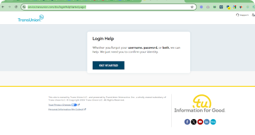

# Template

Enformion is a data aggregation platform that provides solutions for people search.

Why try removing your data?

In addition to providing people-search services themselves, Enformion supplies data to people-search sites through its API.

What data is sold?

Such data contains hundreds of attributes including demographics.

### Removal options
LexisNexis offers several opt-out options, but availability varies by information type and your location.

- **All consumers** can request a disclosure report to review their data. However, if your state lacks privacy laws, you can only correct errors, not remove or opt out of data sharing.
- **Residents of Nevada** can opt out of the sale/ sharing of their personal information with third parties. To do this, select “Opt-Out” when submitting the form.

### ⚠️&nbsp;&nbsp;Important
1. You must provide proof of identity, such as a driver’s license or utility bill, showing your name and current address.
2. Removal requests are often denied as legal records are usually exempt from removal or suppression.

### Where to start

- **California:** [consumer.risk.lexisnexis.com/request#california](https://consumer.risk.lexisnexis.com/request#california)
- **Virginia:** [consumer.risk.lexisnexis.com/request#virginia](https://consumer.risk.lexisnexis.com/request#virginia)
- **Connecticut:** [consumer.risk.lexisnexis.com/request#connecticut](https://consumer.risk.lexisnexis.com/request#connecticut)

## How to make a data deletion request

### Option 1: Creating an account

LexisNexis offers several opt-out options, but availability varies by information type and your location.

- **Step 1:** Access the [form](https://consumer.risk.lexisnexis.com/request)
- **Step 2:** Complete the form with your personal information.
- **Step 3:** Create a username and password for your TransUnion account.

### Option 2: Submitting the request as a guest

Note that if you submit a data deletion request as a guest, responses will be mailed.

- **Step 1**: Access the [guest form](https://service.transunion.com/dss/opt-outStep1.page?)
- **Step 2:** Complete the form with your personal information. Note that all fields are required except those marked as optional
